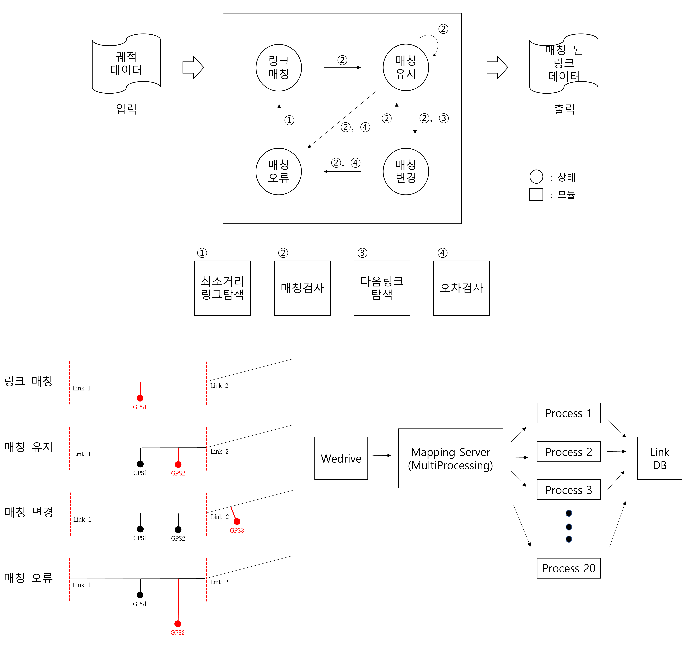

# traj2seg
이 repo는 "그리드 색인 및 상태 천이 모델을 이용한 궤적 데이터 도로 네트워크 매칭 방법"을 구현한 것이다.  

> **Abstract**: 이 논문에서는 상태 천이 모델과 그리드 색인 방법을 이용하는 궤적 데이터에 대한 도로 네트워크 매칭 방법을 제안한다. 제안하는 매칭 방법은 궤적 데이터의 연속적인 위치 데이터에 대해 도로 네트워크에 대한 링크매칭, 매칭유지, 매칭변경, 매칭오류 상태를 판단하는 상태 천이 모델을 통해 매칭 정확도를 향상 시킨다. 또한, 제안하는 매칭 방법은 궤적의 위치 데이터와 도로 네트워크 간의 비교 연산을 줄이기 위해 그리드 색인(Grid Index)을 이용한다. 이 논문에서는 제안하는 방법을 구현하고 기존의 매칭 방법과 비교실험을 수행하여 제안 방법의 우수성을 보인다.

## Dependencies
python 2.8  
haversine 2.3.0  
sharkbite 0.7.4  
pymysql 0.10.1
Flask 2.0.5  

## Dataset
- [표준노드링크데이터](https://www.its.go.kr/nodelink/nodelinkRef) 2019_09_20.geojson  
- Wedrive 궤적 데이터(공개 X)

## How to use
  
전체 구조 실행  
1. `server.py` 실행
2. "uuid"와 "time_begin" 값을 설정 후 `client.py` 실행
  
매핑 실행  
1. `read_segment.py`를 통해 링크 데이터 load
2. `mapping.py`에 링크 데이터와 궤적 데이터를 입력으로 주고 실행

## Mapping Result
case 1  
  
case 2  
  

매칭 정확도  
- GT(Ground Truth) : 149 link
- TP(잘 매칭된 경우) : 121 link
- FP(매칭되면 안되는데 매칭된 경우) : 1 link

## Issue
- 링크가 작은 경우 매칭 오류 발생
- 터널 같은 경우 궤적 데이터가 없어 매칭이 되지 않음
  
[traj2seg-v2](https://github.com/jsm9720/traj2seg-v2)는 서로 연결된 링크를 매칭하는데 잘 매칭되지 않는 문제 개선
